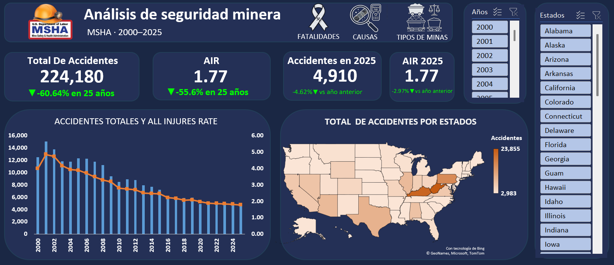
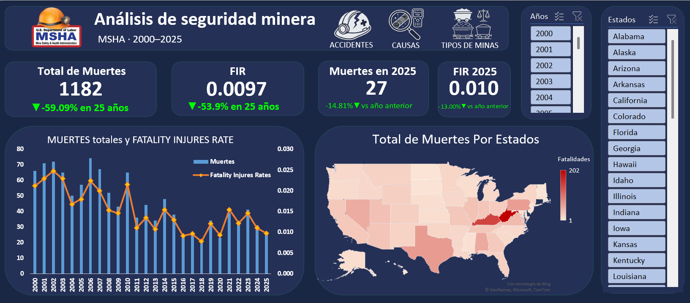
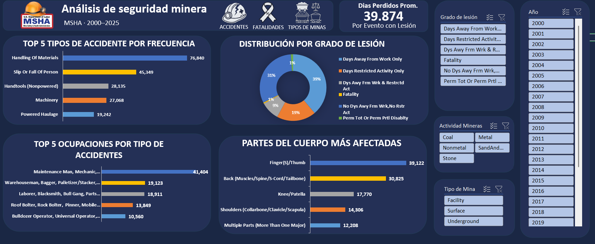
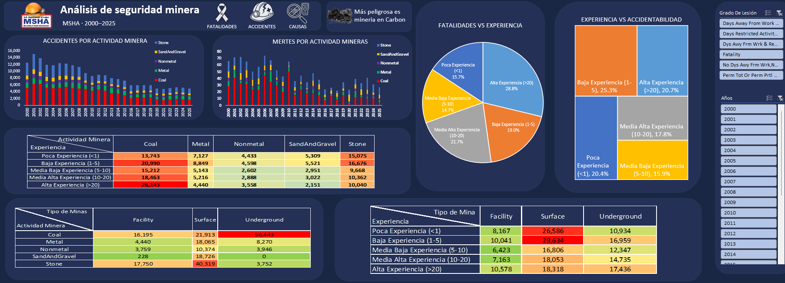

# Mining Safety Analytics 

### Análisis de Accidentabilidad en la Industria Minera de U.S.A. (2000–2025)
---
## 👤 Autor

**Patricio Valenzuela**
 >Tecnico en Operaciones | Mineras Ingeniero Civil en Minas | Analista de Datos
---
## 📌 Descripción del proyecto
Este proyecto analiza alrededor de **300,000 registros reales** de accidentes, lesiones  y fatalidades en la industria minera de EE.UU., utilizando datos oficiales del **Mine Safety and Health Administration (MSHA)**.
Se debe aplicar un analisis de datos en para responder preguntas criticas en la seguridad minera ¿qué tipo de accidentes ocurren con mas frecuencia ?, ¿en qué operaciones ocurren más fatalidades?,¿Cual es la tendencia del FIR.AIR desde 2000 hasta el 2025?.

---

## 🎯 Preguntas de negocio

1. ¿Cuál ha sido la efectividad a largo plazo de las políticas de seguridad minera de la MSHA en los últimos 25 años en términos de volumen e índices de frecuencia ($AIR$ y $FIR$)?.
2. ¿Cuáles son los estados críticos (puntos calientes) donde se concentran la mayor cantidad de accidentes y fatalidades en EE. UU.?
3. ¿Qué tipo de minería y qué métodos de extracción representan el mayor riesgo operacional?
4. ¿Cuáles son los tipos de accidentes más comunes, partes del cuerpo afectadas y puestos de trabajo en la primera línea de riesgo?
5. ¿Cómo influye la experiencia del trabajador en la probabilidad de sufrir un accidente y fatalidad?
 

---
## 🗂️ Estructura del repositorio

```
mining-safety-analytics/
│
├── README.md
│
├── data/
│   ├──         #
│   ├──         #
│   └──         # 
│
├── Iconos/
│   ├── 
│   ├── 
│   ├──      
│   ├── 
│   └── 
│
└── images/
│    ├── dashboard_Accidentes.png
│    ├── dashboard_Tipo_Minas.png
│    ├── dashboard_Causas.png
│    ├── dashboard_Modelo de Datos.png
│    └── Dashboard_Fatalidades.png
│I
│
└── Presentacion Mining injuries.xlsx
```
---
## 📦 Fuente de datos
| Dataset | Fuente | Registros | Actualización |
|---|---|---|---|
| Accident & Injuries | [MSHA Open Data](https://www.msha.gov/msha-datasets) | +300,000 | Semanal |
| Mines Information | [MSHA Mines Dataset](https://catalog.data.gov/dataset/msha-mines-dataset) | +96,000 minas | Semanal |
|AIR & FIR|[Number of employee hours reported](https://wwwn.cdc.gov/NIOSH-Mining/MMWC/Employee/Hours)|+25 registro|anual|

>Los datos son de **acceso público y gratuito**.
---
## 🔄 Flujo de trabajo
```
MSHA Open Data (.txt)
        │
        ▼
   Excel
   └── Importación de Tabla Txt y Xlsm.
   ├── Consultas analíticas
   └── Exportación de vistas limpias
        │
        ▼
   Power Query
   ├── EDA: distribuciones, nulos.
   ├── Cálculo de Años de Experinecia en Rangos.
   └── limpieza de Datos y transformaciones.
        │
        ▼
   Power Pivot
   ├── Transformación final, si es necesarios.
   ├── Modelo estrella (Tablas de Hecho + Tabla de Dimensiones).
   ├── Creacion de Tabla Calendario y Año Fiscal.
   └─  Medidas DAX
        │
        ▼
   Excel
   └── Creación de DashBoard.
   └── Calculos para la interactividad del DashBoard.
        │
        ▼
   GitHub.
```

---
## 🛠️ Herramientas utilizadas

| Herramienta | Uso en el proyecto |
|---|---|
|Power Query|Limpieza,EDA, transformación de datos-Eliminacion de columnas Innesesarias-Corrección de Errores-ETC|
|Power Pivot|Creación de tabla calendario, Año Fiscal y Realizacion del modelo de datos Tipo estrella|
|Excel| Creación de Dashboard Iteractivo|

---
## 📊 Hallazgos principales

**1. ¿Cuál ha sido la efectividad a largo plazo de las políticas de seguridad minera de la MSHA en los últimos 25 años en términos de volumen e índices de frecuencia ($AIR$ y $FIR$)?.**

**2. ¿Cuáles son los estados críticos (puntos calientes) donde se concentran la mayor cantidad de accidentes y fatalidades en EE. UU.?**

**3. ¿Qué tipo de minería y qué métodos de extracción representan el mayor riesgo operacional?**

**4. ¿Cuáles son los tipos de accidentes más comunes, partes del cuerpo afectadas y puestos de trabajo en la primera línea de riesgo?**

**5. ¿Cómo influye la experiencia del trabajador en la probabilidad de sufrir un accidente y fatalidad ?**

---

## 📢 Recomendaciones


---
## 📐 KPIs calculados

| KPI | Definición | Fórmula |
|---|---|---|
| **AIR** | All injures Rate(Tasa de lesiones totales) | (Accidentes registrables × 200,000) / Horas trabajadas |
| **FIR** | fatality Injury Rate (Tasa de Fatalidades) | (  Fatalidades registradas  × 200,000) / Horas trabajadas |
| **Días perdidos promedio** | Severidad promedio por evento | Total días perdidos / Total accidentes con días perdidos |

> El factor 200,000 corresponde a las horas trabajadas por 100 trabajadores en un año de 50 semanas.

> Días perdidos promedio solo se utilizan los eventos que ocurren lesion, es decir, se excluyen las fatalidades y sin eventos de lesion y dias perdidos, ya que afecta al calculo del promedio.

>El año Fiscal lo consideran desde desde octubre del año anterior hasta el septiembre del mismo año.  
---
## 🖼️ Vista previa del dashboard

### Página 1 — Accidentabilidad.


### Página 2 — Fatalidad.

### Página 3 — Causa.

### Página 4 — Tipo de Mina.

### Página 5 — Modelo de Datos.
---
## 📄 Licencia
Los datos utilizados son de dominio público, publicados por el U.S. Department of Labor bajo la iniciativa Open Government Data.
